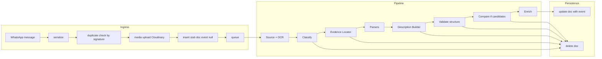

# Event Object Integration: WhatsApp, OpenAI, MongoDB

This document describes how a raw WhatsApp message is turned into a structured event object: data flow, OpenAI calls (prompts and JSON schemas), programmatic validation, enrichment, and the final MongoDB document shape. It is intended as a technical reference for understanding or improving event structuring.

---

## 1. Overview and high-level flow

**Input:** An incoming Baileys WhatsApp message in an allowed group, from another user (not fromMe), with an allowed message type (e.g. text, image with caption).

**Output:** A MongoDB event document with the `event` field populated with the structured event, or the document deleted when the message is not an event, is a duplicate, or fails validation.

**High-level flow:**

**Key files:**

| Role | File |
|------|------|
| Entry | `apps/wa-listener/src/services/whatsappMessageHandler.js` — `handleIncomingMessage` |
| Serialization | `apps/wa-listener/src/services/message.service.js` — `serializeMessage` |
| Pipeline | `apps/wa-listener/src/services/event.service.js` — `processEventPipeline` |
| OpenAI | `apps/wa-listener/src/services/eventOpenAI.service.js` |
| Schemas | `apps/wa-listener/src/consts/openaiSchemas.const.js` |
| Validation | `apps/wa-listener/src/services/eventValidation.js` |
| Enrichment | `apps/wa-listener/src/services/eventEnrichment.js` |
| Persistence | `apps/wa-listener/src/services/eventRepository.js` |

---

## 2. Raw message shape (input to pipeline)

The pipeline receives a **raw message** object produced by `serializeMessage(msg)` in `message.service.js`. The Baileys message is flattened to a stable shape compatible with the rest of the system.

**Fields:**

| Field | Type | Description |
|-------|------|-------------|
| `id` | string \| null | Message key id |
| `type` | string \| null | Legacy type: `text`, `image`, `video`, etc. |
| `t` | number \| null | Message timestamp |
| `notifyName` | string \| null | Push name |
| `from` | string \| null | Remote JID (e.g. group id) |
| `to` | string \| null | Same as from for groups |
| `author` | string \| null | Participant JID (group sender) |
| `text` | string \| null | Body: caption for media, or direct text |
| `hasMedia` | boolean | True if message has media |
| `mediaKey` | — | Set when hasMedia (for decryption) |
| `imgBody` | string \| null | Base64 thumbnail when hasMedia |

Pipeline logic primarily uses `rawMessage.text` and, for enrichment, `rawMessage.author`. When the message had an image, the pipeline also receives a `cloudinaryUrl` (and `cloudinaryData`) from the media upload step. For image messages, OCR (Google Cloud Vision) extracts text used by the pipeline; if Google Vision is unavailable or fails, OCR can fall back to OpenAI Vision when `OCR_FALLBACK_OPENAI_VISION` is enabled.

---

## 3. OpenAI integration — three calls

All three calls use `response_format: { type: 'json_schema', json_schema: ... }`, retries on retryable errors, and a low temperature (0.1). The model and max tokens come from configuration.

### 3.1 Call 1 — Classification

**Purpose:** Decide whether the message describes **one specific event** with a **calendar date**. Reject business hours, multiple events, and relative- or recurring-only dates.

**Input:** `messageText` (sanitized, max 8000 characters) and optional `cloudinaryUrl` (image sent as vision input).

**Prompt (summary):** Implemented in `callOpenAIForClassification` in `eventOpenAI.service.js`. The system prompt includes:

- `getDateTimeContext()` — current date, time, day of week, timezone (Israel), and current year.
- Rules: event must have a specific calendar date (day+month or full date); reject relative-only ("היום", "מחר") or recurring-only ("ימי ראשון") dates; reject business hours, menus, or ads; message must describe a single event (reject "multiple_events"); extract 3–5 Hebrew search key phrases (location, event type, date, venue).
- Examples for event vs non-event (e.g. concert with date → isEvent true; business hours → isEvent false; multiple events → isEvent false).

**Schema:** `CLASSIFICATION_SCHEMA` in `openaiSchemas.const.js`:

- `isEvent` (boolean)
- `searchKeys` (array of strings)
- `reason` (string or null)

**Output usage:** If `!classification.isEvent`, the pipeline calls `cleanupAndDeleteEvent` and exits. If it is an event, `searchKeys` are validated (non-empty strings) and passed to `findCandidateEvents` for MongoDB text search. Classification runs before extraction.

---

### 3.2 Call 2 — Extraction

**Purpose:** Turn the message (and optional image) into a **structured event object**: title, descriptions, location, price, occurrences, categories, urls, and justifications.

**Input:** `messageText` (sanitized), optional `cloudinaryUrl`, and `categoriesList` from `consts/events.const.js` (id + label per category).

**Preprocessing:** Message text is converted to HTML via `convertMessageToHtml` (WhatsApp formatting: bold, lists, blockquotes). A list of extracted URLs from the text is passed in the user content.

**Prompt (summary):** Implemented in `callOpenAIForExtraction`. The system prompt includes:

- **Date/time context:** Same `getDateTimeContext()` as classification.
- **Timezone rule:** All times are Israel local; model must convert to UTC for `startTime` and `endTime` (e.g. 20:00 Israel UTC+2 → `…T18:00:00.000Z`).
- **All-day rule:** If only a date and no time, set `hasTime: false`, `startTime` = that date at Israel midnight in UTC, `endTime: null`.
- **Occurrences:** One object per calendar day; single-day = one object; multi-day = one per day with date, hasTime, startTime, endTime.
- **Categories:** Only allowed category ids from the provided list; at least one category; mapping examples (e.g. dance/party, music/show, workshop, etc.).
- **Field rules:** Title (event name only, no price/date/time/location unless part of name); shortDescription (no price/date/location); fullDescription (HTML, limited tags; URLs and link labels moved to `urls`, not duplicated in description); location (City normalized, CityEvidence verbatim, addressLine1/2, locationDetails for navigation only, wazeNavLink/gmapsNavLink); price (entrance price, 0 if free, null if unclear or only merchandise/food); occurrences; media always `[]` (system adds Cloudinary URL later); urls as `{Title, Url}`; justifications for date, location, startTime, endTime, price — or exactly `"Not stated in message or image."` when no source.
- **Image rules:** Text is primary; image secondary; cite image in justifications when used.
- One full JSON example in the prompt.

**Schema:** `EXTRACTION_SCHEMA` in `openaiSchemas.const.js`, built from `EVENT_SCHEMA_PROPERTIES`:

- Required top-level: `media`, `urls`, `categories`, `mainCategory`, `Title`, `fullDescription`, `shortDescription`, `location`, `price`, `occurrences`, `justifications`.
- `location`: required keys `City`, `CityEvidence`, `addressLine1`, `addressLine2`, `locationDetails`, `wazeNavLink`, `gmapsNavLink` (nullable where applicable).
- `occurrences`: array, minItems 1; each item `date`, `hasTime`, `startTime`, `endTime`.
- `justifications`: required keys `date`, `location`, `startTime`, `endTime`, `price` (all strings).

**Output:** A single event object. The `media` array from the model is always empty; the system fills it during enrichment from the Cloudinary URL when the message had an image.

---

### 3.3 Call 3 — Comparison (only when candidates exist)

**Purpose:** Decide whether the extracted event is a **new_event**, **existing_event** (same event, repost), or **updated_event** (same event with changes) compared to candidate events from the database.

**Input:** The validated event, `messageText`, and `candidates` from `findCandidateEvents(searchKeys, eventId)`.

**Important:** `findCandidateEvents` in `eventRepository.js` currently projects only `_id` and `rawMessage.text`. The `event` field is not included, so in the comparison prompt each candidate’s Title, City, Date, and StartTime appear as "(no title)" or "(none)". The comparison therefore relies on candidate IDs and raw message text unless the projection is extended to include `event`.

**Prompt (summary):** Implemented in `callOpenAIForComparison`. System prompt defines:

- `new_event`: different event or no match.
- `existing_event`: same event, no meaningful changes (repost).
- `updated_event`: same event with changes (e.g. price, dates, links, location, description).
- Two events are the same only if they match on similar title, same city, same category type, and same or very close date.

User content includes the new event’s title, city, date, startTime, categories, and message text, plus per-candidate: ID, title, city, date, startTime, and message text.

**Schema:** `COMPARISON_SCHEMA`:

- `status`: enum `'new_event' | 'existing_event' | 'updated_event'`
- `matchedCandidateId`: string or null
- `reason`: string

**Output usage:** If status is `existing_event` or `updated_event`, the pipeline deletes the new document and sends an "already existing" confirmation. Otherwise it proceeds to save the event as new.

---

## 4. Programmatic validation and structure check

**After extraction**, the pipeline runs two validation steps.

### 4.1 Programmatic validation — `validateEventProgrammatic`

Implemented in `eventValidation.js`. It mutates the event and applies corrections; it can return `event: null` for unfixable cases.

- **Categories:** Invalid or missing categories are replaced with fallback `community_meetup`; `mainCategory` must be in `categories` (corrected if not).
- **Justifications:** The exact phrase `NOT_STATED_JUSTIFICATION` ("Not stated in message or image.") is treated as "no source". If a field has a value but its justification is this phrase, the field is cleared or normalized: e.g. time of day cleared to all-day, endTime set to null, location cleared, price set to null.
- **Location:** If `CityEvidence` is set, it must appear verbatim in the message text; otherwise City and CityEvidence are cleared. If City has no CityEvidence, City is cleared. Verbatim check for addressLine1, addressLine2, locationDetails — if not found in message, cleared.
- **Occurrences:** startTime must be valid date; if more than 2 years in future, logged as suspicious; invalid endTime cleared; if `date` and `startTime` (in Israel) disagree, startTime is normalized (all-day → Israel midnight UTC, or local time rebuilt from occurrence date).
- **All-day:** When `hasTime === false`, startTime is set to Israel midnight UTC for that date, endTime to null.
- **Media/urls:** media forced to `[]`, urls to array if missing.
- **Title:** If Title contains price-like text (₪, שקל, etc.), a correction is logged but not changed.

Returns `{ event, corrections }` or `{ event: null, corrections }`.

### 4.2 Structure check — `validateEventStructure`

Also in `eventValidation.js`. Pure structural checks (no mutation):

- Event is a non-null object.
- `Title` is a non-empty string.
- `categories` is a non-empty array; `mainCategory` is a non-empty string and is in `categories`.
- `location` is an object.
- `occurrences` is a non-empty array; each item has `date` (YYYY-MM-DD), `hasTime` (boolean), `startTime` (non-empty string).
- `justifications` exists and has string values for `date`, `location`, `startTime`, `endTime`, `price`.

Used after programmatic validation and again before enrichment. If invalid, pipeline cleans up and exits.

---

## 5. Enrichment

**Purpose:** Add data that does not come from OpenAI.

Implemented in `eventEnrichment.js` — `enrichEvent(event, authorId, cloudinaryUrl, originalMessage, client)`.

- **Structure:** Runs `validateEventStructure(event)`; throws if invalid.
- **publisherPhone:** Resolved from WhatsApp `authorId` via `resolvePublisherPhone(authorId, originalMessage, client)`; set on `event.publisherPhone` or undefined.
- **media:** `event.media` is set to `[cloudinaryUrl]` when `cloudinaryUrl` is present, otherwise `[]`. The extraction model always returns an empty media array; this step attaches the single Cloudinary image URL when the message had an image.

The enriched event is what is passed to `updateEventDocument`.

---

## 6. MongoDB document shape

### 6.1 Insert (stub)

`eventRepository.insertEventDocument(rawMessage, cloudinaryUrl, cloudinaryData, messageSignature)` creates a document with:

- `createdAt` (Date)
- `rawMessage` (full serialized message object)
- `cloudinaryUrl` (string or null)
- `cloudinaryData` (object or null)
- `event`: **null**
- `previousVersions`: []
- `isActive`: true
- `messageSignature`: string or null (hash of message text for duplicate detection)

### 6.2 Update (success path)

`updateEventDocument(eventId, enrichedEvent)` sets the document’s `event` field to the enriched event object. This path does not set `updatedAt` (that is only set when using `updateEventWithNewData`).

### 6.3 Final event object shape (stored in `event`)

For reference, the enriched event object has the following shape:

- **Title** (string)
- **shortDescription** (string)
- **fullDescription** (string, HTML)
- **categories** (array of category ids)
- **mainCategory** (string, one of categories)
- **location** (object):
  - `City` (string)
  - `CityEvidence` (string or null)
  - `addressLine1`, `addressLine2`, `locationDetails` (string or null)
  - `wazeNavLink`, `gmapsNavLink` (string or null)
- **price** (number or null)
- **occurrences** (array): each `{ date, hasTime, startTime, endTime }`
- **media** (array of strings — URLs, typically one Cloudinary URL)
- **urls** (array of `{ Title, Url }`)
- **justifications** (object): `date`, `location`, `startTime`, `endTime`, `price` (strings)
- **publisherPhone** (string or undefined)

The event object also includes **verificationReport** (per-field evidence candidates and chosen values for date, timeOfDay, location, price) and **needsReview** (boolean, true when location was not verified or price could not be parsed).

The API or frontend may expose this with different casing (e.g. `title` vs `Title`); see `types/events.d.ts` for the application’s event types.

---

## 7. Constants and configuration relevant to event structure

- **Categories:** `consts/events.const.js` — `EVENT_CATEGORIES` and `getCategoriesList()`. Extraction must use only these category ids; validation falls back to `community_meetup` when none valid.
- **Justifications:** In `apps/wa-listener/src/consts/events.const.js`, `NOT_STATED_JUSTIFICATION = 'Not stated in message or image.'`. Validation uses this exact phrase to detect "no source" and may clear the corresponding field.
- **Date/time context:** `getDateTimeContext()` (in the same file) returns current date, time, day of week, timezone (Asia/Jerusalem), and UTC offset. It is injected into the classification and extraction system prompts so the model can resolve relative dates and times.
- **OpenAI:** Model name and max tokens come from configuration. All three calls use `response_format: { type: 'json_schema', json_schema: ... }` and retry logic for 429, 5xx, and 408 errors.

---

## 8. Failure and cleanup paths

| Scenario | When | Action |
|----------|------|--------|
| **Duplicate (by signature)** | Before insert | No document created; confirmation sent with duplicate reason. |
| **No text** | After pipeline start | `cleanupAndDeleteEvent`: delete Cloudinary asset if any, delete event document, send confirmation (e.g. NO_TEXT). |
| **Not an event** | After classification | Same cleanup; reason from classification (e.g. NOT_EVENT, NO_DATE, MULTIPLE_EVENTS). |
| **Classification failed** | API error | Same cleanup; AI_CLASSIFICATION_FAILED. |
| **Extraction failed** | API error | Same cleanup; reason logged as AI_COMPARISON_FAILED. |
| **Validation failed** | Programmatic or structure | Same cleanup; VALIDATION_FAILED, with reason/corrections. |
| **Comparison: existing_event / updated_event** | After comparison | Same cleanup; ALREADY_EXISTING. |
| **Enrichment or update error** | In handleNewEvent | Same cleanup; ENRICHMENT_ERROR or DATABASE_ERROR. |
| **Pipeline exception** | Any uncaught error | Same cleanup; PIPELINE_ERROR. |

In all cleanup paths that run after a document was inserted, `cleanupAndDeleteEvent` is used: it deletes the Cloudinary media (if present), deletes the event document, and sends a confirmation message with the appropriate reason to the configured log group.
